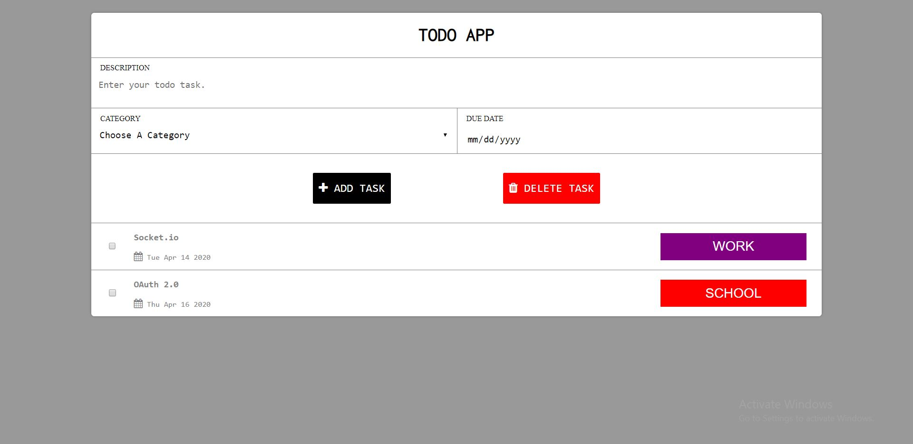

# Basic Todo Web App
.

***
Commands to run:
***
1.) Install packages using below command(express, mongoose, ejs).  
```
npm install 
```
2.) Install nodemon first or change the start from package.json to node 'index.js'
```
npm start
```
[Live Preview](http://toodoos-app.herokuapp.com/?target=_blank)
